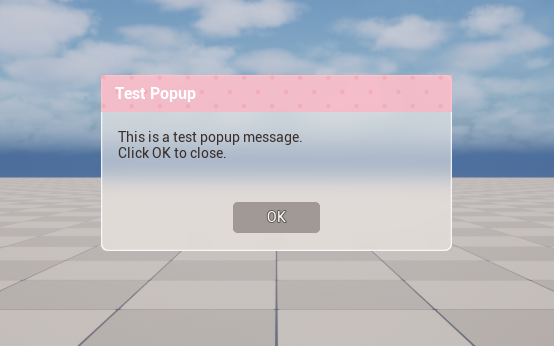

# UMGStyleKit Plugin

## 개요

순수 C++ 코드로 UMG 위젯을 구성하면 기능적으로는 문제가 없지만, 시각적으로 **단조롭고 밋밋한** 디자인이 되기 쉽습니다. 색상, 폰트, 패딩 등의 스타일 값이 코드에 하드코딩되면 디자인 수정이 어렵고, 일관된 테마 적용도 힘들어집니다.

**UMGStyleKit**은 이러한 문제를 해결하기 위해 만들어진 플러그인입니다:
- 스타일 정의를 **Data Asset**으로 분리하여 에디터에서 쉽게 수정
- **GameInstance Subsystem**을 통해 전역 스타일 관리
- 코드에서 UI 구조를 만들되, 디자인은 에셋에서 가져오는 방식



---

## 플러그인 구조

```
Plugins/UMGStyleKit/
├── Source/UMGStyleKit/
│   ├── Public/
│   │   ├── UMGStyleSubsystem.h      # GameInstance 서브시스템
│   │   ├── UMGStyleDataAsset.h      # 범용 스타일 데이터 애셋
│   │   ├── UMGStyleLibrary.h        # BP 함수 라이브러리
│   │   ├── UTestPopupStyleAsset.h   # 팝업 전용 스타일 애셋
│   │   ├── UTestPopupWidget.h       # 테스트 팝업 위젯
│   │   └── UTestPopupGameMode.h     # 테스트용 게임모드
│   └── Private/
│       └── (구현 파일들)
└── Docs/
    └── Images/
```

---

## 핵심 클래스

### UMGStyleSubsystem

`UGameInstanceSubsystem`을 상속받아 게임 전체에서 스타일 애셋에 접근할 수 있게 합니다.

```cpp
// GameInstance에서 자동 생성됨
UUMGStyleSubsystem* Subsystem = GameInstance->GetSubsystem<UUMGStyleSubsystem>();

// 스타일 애셋 등록
Subsystem->RegisterStyleAsset(StyleDataAsset);
Subsystem->RegisterPopupStyleAsset(PopupStyleDataAsset);

// 스타일 조회
const FUMGStyleEntry& Style = Subsystem->GetStyle(TEXT("ButtonPrimary"));
UTestPopupStyleAsset* PopupStyle = Subsystem->GetPopupStyleAsset();
```

### UTestPopupStyleAsset

팝업 위젯 전용 스타일을 정의하는 Data Asset입니다.

| 속성 | 설명 |
|------|------|
| `PanelBrush` | 팝업 전체 배경 |
| `PopupSize` | 팝업 크기 (기본 400x200) |
| `TitleBackgroundBrush` | 타이틀바 배경 (텍스처 적용 가능) |
| `TitleFont`, `TitleTextColor` | 타이틀 텍스트 스타일 |
| `ClientPadding` | 클라이언트 영역 패딩 |
| `MessageFont`, `MessageTextColor` | 메시지 텍스트 스타일 |
| `OKButtonStyle` | 버튼 스타일 (Normal/Hovered/Pressed) |
| `ButtonFont`, `ButtonTextColor` | 버튼 텍스트 스타일 |

### UTestPopupWidget

`RebuildWidget()`에서 UI를 동적으로 구성하는 테스트 팝업 위젯입니다.

**UI 구조:**
```
CanvasPanel (Root - 화면 중앙 정렬)
└── SizeBox (크기 제한)
    └── Border (Panel - 배경)
        └── VerticalBox
            ├── Border (Title)
            │   └── TextBlock (Title Text)
            └── Border (Client)
                └── VerticalBox
                    ├── TextBlock (Message)
                    └── Button (OK)
```

**스타일 적용 흐름:**
1. `RebuildWidget()`에서 UI 구조 생성
2. `NativeConstruct()`에서 `ApplyStyles()` 호출
3. `ApplyStyles()`가 서브시스템에서 스타일 조회 후 적용

---

## 사용 방법

### 1. GameInstance 설정

`UMGDemoGameInstance`(또는 커스텀 GameInstance)에서 스타일 애셋을 등록합니다:

```cpp
void UUMGDemoGameInstance::Init() {
  Super::Init();
  
  UUMGStyleSubsystem* Subsystem = GetSubsystem<UUMGStyleSubsystem>();
  if (Subsystem) {
    if (StyleDataAsset) {
      Subsystem->RegisterStyleAsset(StyleDataAsset);
    }
    if (PopupStyleAsset) {
      Subsystem->RegisterPopupStyleAsset(PopupStyleAsset);
    }
  }
}
```

### 2. Data Asset 생성

1. 콘텐츠 브라우저에서 우클릭 → **Miscellaneous → Data Asset**
2. **UTestPopupStyleAsset** 선택
3. 스타일 속성 설정 (색상, 폰트, 패딩 등)

### 3. GameInstance Blueprint에서 연결

1. `BP_GameInstance` 열기
2. **Style Data Asset** 속성에 범용 스타일 애셋 연결
3. **Popup Style Asset** 속성에 팝업 스타일 애셋 연결

### 4. Project Settings

```
Edit → Project Settings → Maps & Modes
├── Default GameMode: ATestPopupGameMode (또는 BP 버전)
└── Game Instance Class: BP_GameInstance
```

---

## 커스터마이징

### 패턴 텍스처 적용

타이틀바에 도트 패턴 등의 텍스처를 적용하려면:

1. 패턴 이미지를 Content 폴더에 임포트
2. Data Asset에서 `Title Background Brush → Image`에 텍스처 연결
3. `Draw As`를 `Image`로 변경

### 새 팝업 스타일 추가

다른 유형의 팝업이 필요하면:
1. `UTestPopupStyleAsset`을 참고하여 새 스타일 애셋 클래스 생성
2. `UMGStyleSubsystem`에 등록/조회 함수 추가
3. 새 위젯 클래스에서 해당 스타일 사용

---

## 기본 테마

플러그인에는 파스텔 테마가 기본값으로 설정되어 있습니다:

| 요소 | 색상 코드 |
|------|-----------|
| 패널 배경 | `#F5EBE0` (파스텔 베이지) |
| 타이틀바 | `#FFD6E0` (파스텔 핑크) |
| 버튼 | `#C4A484` (라이트 브라운) |
| 텍스트 | `#5D4037` (다크 브라운) |

---

## 라이선스

MIT License - 자세한 내용은 [LICENSE](LICENSE) 파일을 참조하세요.
